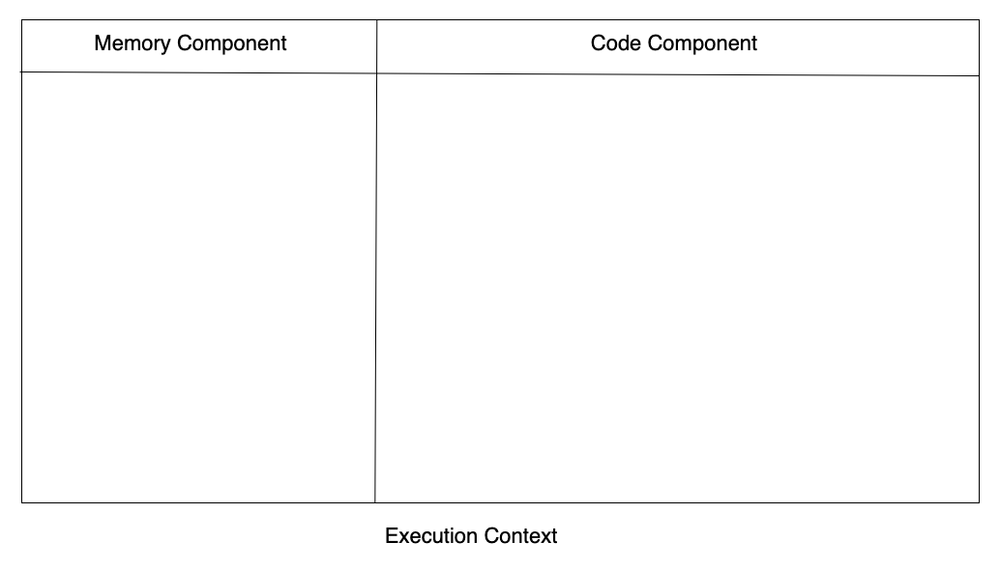

<!-- omit from toc -->

# Table of Contents

- [Table of Contents](#table-of-contents)
  - [Core Fundamentals of JS](#core-fundamentals-of-js)
    - [Execution Context](#execution-context)
    - [How JS works?](#how-js-works)
    - [References](#references)

## Core Fundamentals of JS

Javascript is a synchronous single threaded language.

- Synchronous - Executes the code one after the other. i.e., JS executes the line and then goes to next
- Single threaded - Executes one command at a time. i.e., one task at a time

### Execution Context

JS executes code in Execution context. Execution context is a container where all our codes be executed.


Execution context includes two major parts,

1. Memory component(Environment Variable) - Variables will be stored as key value pairs
2. Code component(Thread of Execution) - The code will be executed here

Execution context includes two major phases,

1. Memory creation phase
2. Code execution phase

**Memory Creation Phase** -
In Memory Allocation phase, JS reads the whole code and creates memory for each variables and functions. In case of variables it stores undefined in it. In case of functions it stores the whole code to it

**Code Execution Phase**
In code execution phase, JS runs through the code again and it assigns the actual values to variables. Also, a new execution context is created whenever there is a function invocation. Hence, the memory creation phase and code execution phase will be carried over in the new execution context created for the function.

**Rules/Concepts of Execution context**

- When we run a JS program, a new execution context will be created
- JS creates memory for variables and functions in Memory creation phase
- JS allocates actual values to variables in Code execution phase
- A new execution context will be created when a new function is read in code execution phase. Hence, the memory creation phase and code execution phase will be carried over in the new execution context created for the function.
- Once the function code got executed the control is given back to the place where the function was called and the execution context of the function will be deleted.

Example for Execution context and Phases,

```js
var n = 2;
function square(num) {
  var ans = num * num;
  return ans;
}
square2 = square(n);
square4 = square(4);
```

1. When JS program is run, A Execution context will be created with Memory component(Variable environment) and Code component(Thread of Execution). Similarly when the above code is read, a new context is created



### How JS works?

### References

1. [Namaste Javascript][1]
2. [Udemy JS - Accelerated JS Training][2]
3. [Udemy JS - Accelerated ES6 Training][3]
4. [Udemy JS][4]

[1]: https://www.youtube.com/watch?v=pN6jk0uUrD8&list=PLlasXeu85E9cQ32gLCvAvr9vNaUccPVNP
[2]: https://www.udemy.com/course/javascript-bootcamp-2016/
[3]: https://www.udemy.com/course/es6-bootcamp-next-generation-javascript/
[4]: https://www.udemy.com/coursejavascript-the-complete-guide-2020-beginner-advanced/
