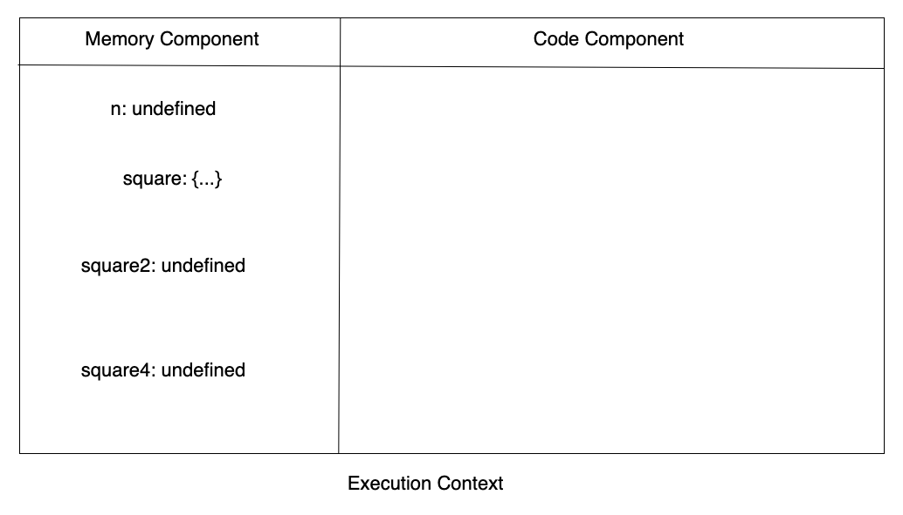
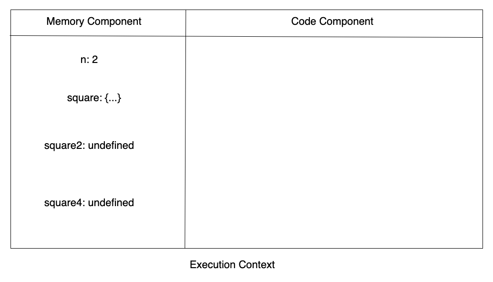

<!-- omit from toc -->

# Table of Contents

- [Table of Contents](#table-of-contents)
  - [Core Fundamentals of JS](#core-fundamentals-of-js)
    - [Execution Context](#execution-context)
        - [How execution context is managed?](#how-execution-context-is-managed)
    - [How JS works?](#how-js-works)
    - [References](#references)

## Core Fundamentals of JS

Javascript is a synchronous single threaded language.

- Synchronous - Executes the code one after the other. i.e., JS executes the line and then goes to next
- Single threaded - Executes one command at a time. i.e., one task at a time

### Execution Context

JS executes code in Execution context. Execution context is a container where all our codes be executed.


Execution context includes two major parts,

1. Memory component(Environment Variable) - Variables will be stored as key value pairs
2. Code component(Thread of Execution) - The code will be executed here

Execution context includes two major phases,

1. Memory creation phase
2. Code execution phase

**Memory Creation Phase** -
In Memory Allocation phase, JS reads the whole code and creates memory for each variables and functions. In case of variables it stores undefined in it. In case of functions it stores the whole code to it

**Code Execution Phase**
In code execution phase, JS runs through the code again and it assigns the actual values to variables. Also, a new execution context is created whenever there is a function invocation. Hence, the memory creation phase and code execution phase will be carried over in the new execution context created for the function.

**Rules/Concepts of Execution context**

- When we run a JS program, a new execution context will be created
- JS creates memory for variables and functions in Memory creation phase
- JS allocates actual values to variables in Code execution phase
- A new execution context will be created when a new function is read in code execution phase. Hence, the memory creation phase and code execution phase will be carried over in the new execution context created for the function.
- Once the function code got executed the control is given back to the place where the function was called and the execution context of the function will be deleted.
- The execution context of functions will be deleted once the JS completes executing the entire code of the function. Same applies for Global context

Example for Execution context and Phases,

```js
var n = 2;
function square(num) {
  var ans = num * num;
  return ans;
}
square2 = square(n);
square4 = square(4);
```

1. When JS program is run, A Execution context will be created with Memory component(Variable environment) and Code component(Thread of Execution). Similarly when the above code is read, a new execution context is created


2. As next step, JS runs over Memory creation phase. In this phase variables for `n, square2, square4` will be created and allocated with undefined. Also, JS allocates memory for function and copies the entire function code in it



3. As further step, JS run over Code execution phase. In this phase JS runs through the actual code and assigns the actual values in the variables and execute the functions(function invocation)

> Note: When a new function is executed by JS, it will create a new execution context

In our example, In code execution phase JS starts executing it from line no.1. It will assign the value `2` to variable `n`. Hence,



For line 2, `function square {...}` will not affect execution context since it is not invoked yet

For line 6 `square2 = square(n)`, a new function execution context will be created since it is a function invocation. Hence,


Now the Memory creation phase and code execution phase will be executed for the newly created execution context.

> Memory will be allocated for Parameter variable as well

As part of Memory creation phase for the function(square2), variables `num` and `ans` will be created and assigned with value of undefined


As part of Code execution phase, JS start executing the code inside the `square` function. It assigns the actual value `2` which is being passed as argument from line.no 6 `square2 = square(2)`.


Now JS continues to execute the code inside the function,

```js
function square(num) {
  var ans = num * num;
  return ans;
}
```

It computes `var ans = num * num` in code execution phase as next step. So it computes `2 * 2 = 4` and stores the value 4 in ans


Now JS execute the last line of square function `return ans`. As a result the control return to the caller of the function `square2 = square(2)`. Hence `square2` will now get the value of `4` Also there is no more code to be executed for the current context it will be deleted.


1. Now, Global Code execution Phase continues to run. As part of the phase JS executes `square4 = square(4)`. Since it is also a function a new execution context will be created. In memory creation phase variables `num, ans` will be created and assigned with undefined. In code execution phase, `num` gets value of `4` since it is passed as argument. And `ans = num * num` will be computed to `16`(4 \* 4) and `ans` will get the value of `16`. The value of ans will be returned to caller `square4 = square(4)`. Since no more code to be executed it will delete the execution context. Also there is no more code to executed in global execution context, it will also be deleted.


##### How execution context is managed?

All the deletion and creation of execution context is managed in Call Stack maintained by JS. Whenever a JS code starts executing the Global execution context(GEC) will be pushed into the Call stack. Also when there is a function invocation, Execution context(EC) of the particular functions is also pushed into the Call Stack. When the JS executes the completely the execution context will be popped out.

From our example, this will be our call stack


**Other Names of Call stack**
* Execution context stack
* Control stack
* Program stack
* Runtime stack
* Machine stack

### How JS works?

### References

1. [Namaste Javascript][1]
2. [Udemy JS - Accelerated JS Training][2]
3. [Udemy JS - Accelerated ES6 Training][3]
4. [Udemy JS][4]

[1]: https://www.youtube.com/watch?v=pN6jk0uUrD8&list=PLlasXeu85E9cQ32gLCvAvr9vNaUccPVNP
[2]: https://www.udemy.com/course/javascript-bootcamp-2016/
[3]: https://www.udemy.com/course/es6-bootcamp-next-generation-javascript/
[4]: https://www.udemy.com/coursejavascript-the-complete-guide-2020-beginner-advanced/
